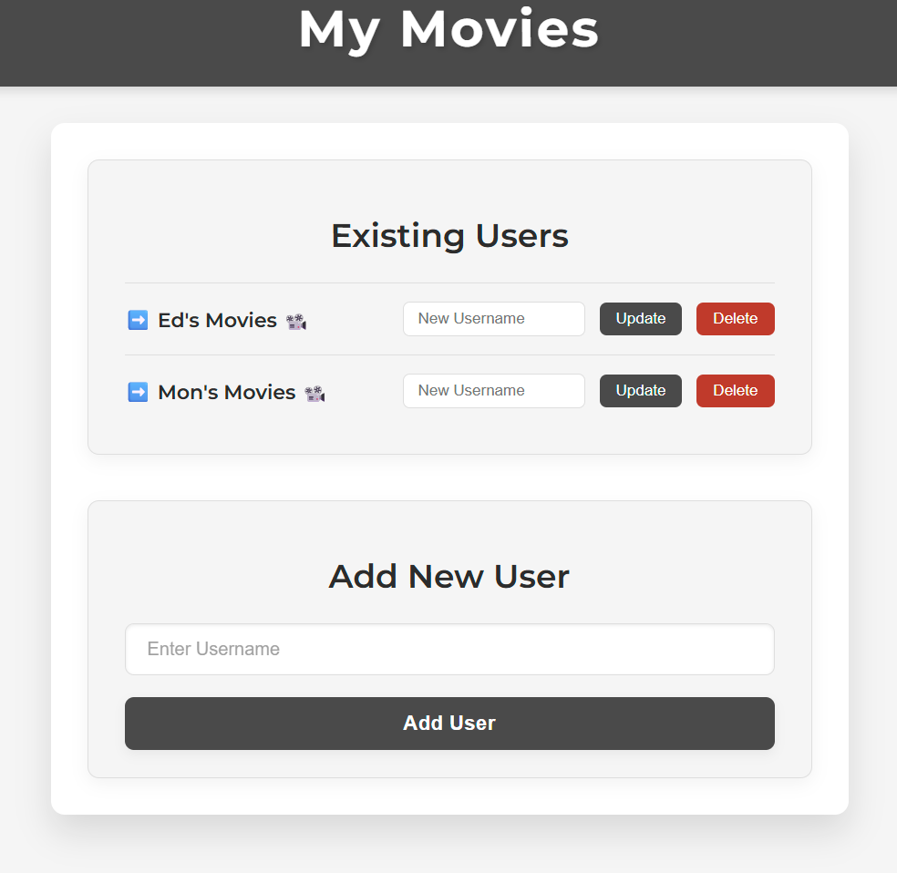

# My Movies 

This app aims at collecting all your favorite movies (or all that you want really) and display this collection into a beautiful HTML frontend.



## Installation

To install this app, simply clone the repository and install the dependencies in requirements.txt using `pip`

```bash
   pip install -r requirements.txt
```

## Usage

To use this app, run the following command `python my_movies.py`
> - The app now supports multi-users with individual collection and website for each user, you'll first be prompted to select a user (you may Add, Delete, or Update a user)
> - You may add a new user, update an existing username or delete one

Once the user selected, you'll be presented with your movies list:
> - You can add a new movie by typing in a title, the app will fetch the data from the OMDB API
> - Once in your list, you may update the movie title, should the official one not be to your liking
> - You may also add a personal note for each movie
> - Finally, you may delete a movie that's on your list

## Project Status

As of _07-JUL-2025_, project is: _MVP_

## Room for Improvement

> - While adding a new movie, a list of results could be provided to the user instead of selecting the first one returned
> - More data could be provided on the frontend
> - Some KPIs could be presented to the user
> - Random Movie or AI recommendation
> - Search function
> - Sorting function
> - Filter function
> - Log and API limits
> - Password-protected user selection
> - Apply CSS framework (Bootstrap or Bulma)
> - Include images from Unsplash
> - Include icons from Font Awesome
> - Apply coloring from Adobe Color

## Acknowledgements

A special thanks to the entire team at Masterschool for providing the guidance in building this app.

## Contributing

I welcome any contributions! If you'd like to contribute to this project, please reach out to [email@edgroell.com](mailto:email@edgroell.com)